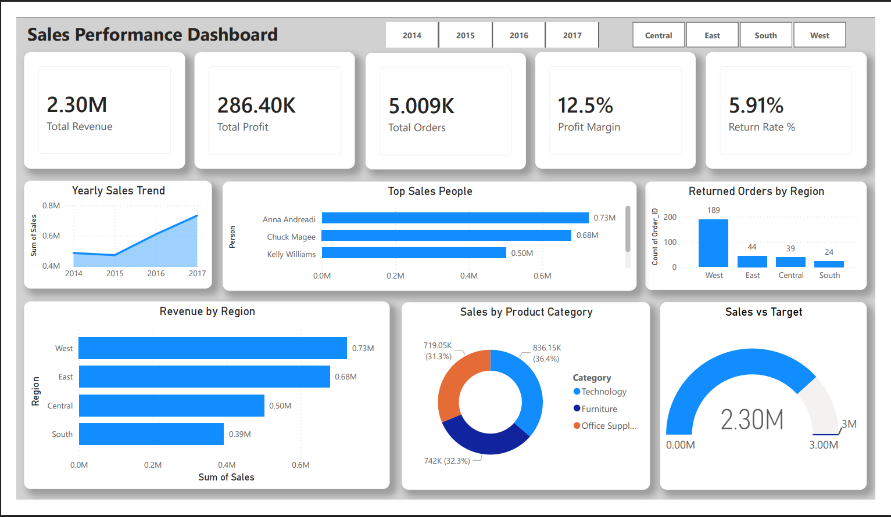

# End-to-End Retail Sales Analysis Dashboard

## Project Overview

This project analyzes retail sales data to uncover meaningful business insights and visualize performance metrics through an interactive Power BI dashboard.

It demonstrates a complete data analytics workflow including data cleaning, database integration, KPI creation, and dashboard design.

The goal is to help stakeholders understand sales trends, profitability, regional performance, and return rates for better decision-making.

## Objectives

* Analyze overall sales and profit performance
* Identify top-performing regions and categories
* Evaluate profit margins and return rates
* Track yearly sales trends
* Build an interactive dashboard with filters

## Tools \& Technologies Used

* Python
* Pandas
* SQLite
* Jupyter Notebook
* Power BI
* DAX (Data Analysis Expressions)

## Project Structure

retail-sales-analysis-dashboard/

* retail\_sales\_analysis.ipynb
* sales\_performance\_dashboard.pbix
* superstore\_dataset.xlsx
* dashboard.png
* README.md

## Dashboard Features

### KPI Cards

* Total Revenue
* Total Profit
* Total Orders
* Profit Margin
* Return Rate

### Visualizations

* Yearly Sales Trend
* Revenue by Region
* Sales by Category
* Top Sales Representatives
* Sales vs Target Comparison

### Interactive Filters

* Year Filter
* Region Filter

## Key Insights

* The Technology category generates the highest revenue.
* The West region contributes the most to overall sales.
* Some categories have high sales but lower profit margins.
* Sales show steady growth across years.
* A small number of salespeople contribute significantly to revenue.

## How to Use

1. Open retail\_sales\_analysis.ipynb to view data analysis.
2. Open sales\_performance\_dashboard.pbix in Power BI.
3. Use Year and Region filters to explore the dashboard interactively.

## Skills Demonstrated

* Data Cleaning and Preparation
* Exploratory Data Analysis (EDA)
* SQL Database Integration
* KPI Development
* Dashboard Design
* Business Insight Generation
* Analytical Thinking

## Project Type

End-to-End Data Analytics Project

## Author

Narendra Damera

